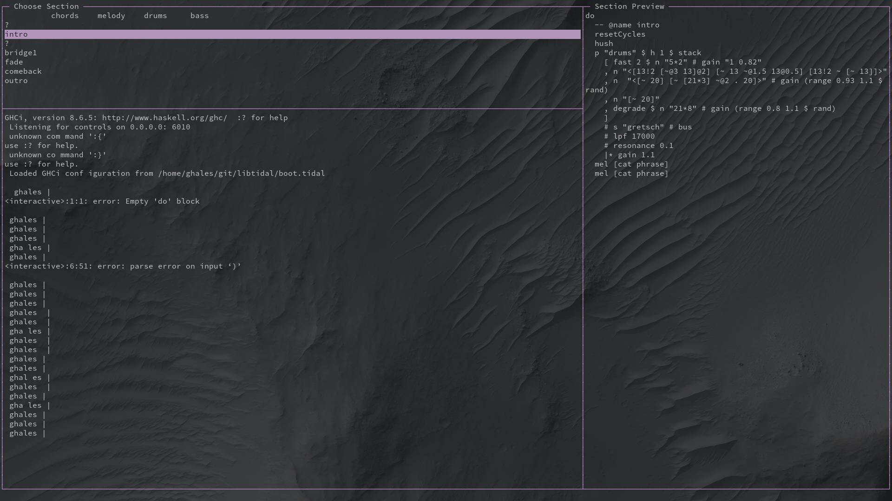

# seg

A LiveCoding Session Manager.

## ⚠️ Work in Progress ⚠️
(nothing works right now)

 

Open a file with `./seg <filename>`. seg will detect the channels, sections, players and instruments declared on the track and display a grid.

Supports the following tools:

 - [ ] TidalCycles
 - [ ] FoxDot
 - [ ] Sonic Pi
 - [ ] SuperCollider

Made with ❤ and ClojureScript

## Installation

The tool is under development following the [cljs-tui-template](https://github.com/eccentric-j/cljs-tui-template). Read about it for more information on how the project is structured and how to contribute.

TL;DR it uses [reagent](https://reagent-project.github.io/)/[reframe](https://github.com/Day8/re-frame) ([react](https://reactjs.org/)/[redux](https://redux.js.org/) for cljs) to create interfaces using [react-blessed](https://github.com/Yomguithereal/react-blessed) components, which interface with the [blessed](https://github.com/chjj/blessed) terminal interface engine.

ATM. I'm organizing the project roadmap via issues. Feel free to grab one and tackle it.

## Usage

Choose section with `up/down` (`j/k`), press `enter` to trigger a section, press `e` to edit a section/pattern/player with your favorite text editor.

## License
Copyright 2020 FIXME

Licensed under the Apache License, Version 2.0 (the "License");
you may not use this file except in compliance with the License.
You may obtain a copy of the License at

    http://www.apache.org/licenses/LICENSE-2.0

Unless required by applicable law or agreed to in writing, software
distributed under the License is distributed on an "AS IS" BASIS,
WITHOUT WARRANTIES OR CONDITIONS OF ANY KIND, either express or implied.
See the License for the specific language governing permissions and
limitations under the License.
